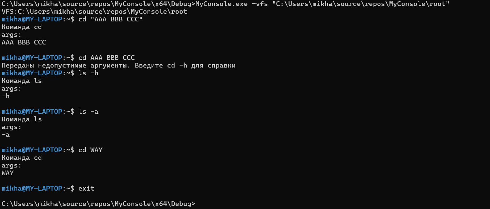
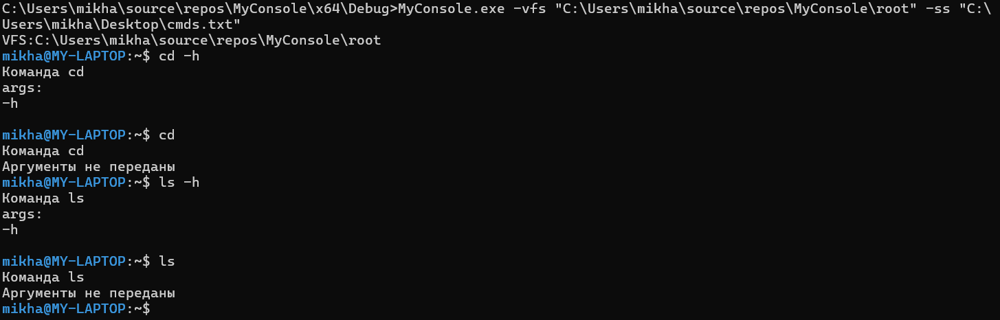

# (26 ВАРИАНТ) Отчет по реализации эмулятора командной оболочки 

## Этап 1 REPL

### Реализованная функциональность

1. **Консольный интерфейс**: Создан интерактивный интерфейс командной строки
2. **Приглашение ко вводу**: Реализовано в формате `username@hostname:directory$`
3. **Парсер с поддержкой кавычек**: Корректно обрабатывает аргументы в кавычках
4. **Обработка ошибок**: Сообщения об неизвестных командах и неверных аргументах
5. **Базовые команды**: Реализованы команды `ls`, `cd` (заглушки) и `exit`

### Примеры работы

#### Приглашение командной строки
```bash
mikha@MY-LAPTOP:~$
```

#### Обработка аргументов с кавычками
```bash
mikha@MY-LAPTOP:~$ ls "AAA BBB CCC"
Команда ls
args:
AAA BBB CCC
```

#### Обработка ошибок
```bash
mikha@MY-LAPTOP:~$ fdasfdsaf
Команда fdasfdsaf не найдена.
```

#### Выход из эмулятора (Пример из Visual Studio)
```bash
mikha@MY-LAPTOP:~$ exit

C:\Users\mikha\source\repos\MyConsole\x64\Debug\MyConsole.exe (процесс 26744) завершил работу с кодом 0 (0x0).
Нажмите любую клавишу, чтобы закрыть это окно:
```

## Этап 2: Конфигурация

### Реализованная функциональность

1. **Параметры командной строки**:
   - `-vfs`: Путь к виртуальной файловой системе
   - `-ss`: Путь к стартовому скрипту

2. **Обработка стартового скрипта**: Выполнение команд из файла с отображением ввода и вывода

3. **Остановка при ошибке**: Скрипт прерывается при первой встреченной ошибке

### Примеры использования

#### Запуск с параметрами
```bash
C:\Users\mikha\source\repos\MyConsole\x64\Debug>MyConsole.exe -vfs "C:\Users\mikha\source\repos\MyConsole\root" -ss "C:\Users\mikha\Desktop\cmds.txt"
```

#### Содержание тестового скрипта 1
```bash
# cmds.txt
cd -h
cd
ls -h
ls
```

#### Вывод выполнения скрипта
```bash
VFS:C:\Users\mikha\source\repos\MyConsole\root
mikha@MY-LAPTOP:~$ cd -h
Команда cd
args:
-h

mikha@MY-LAPTOP:~$ cd
Команда cd
Аргументы не переданы
mikha@MY-LAPTOP:~$ ls -h
Команда ls
args:
-h

mikha@MY-LAPTOP:~$ ls
Команда ls
Аргументы не переданы
mikha@MY-LAPTOP:~$
```
#### Пример остановки при ошибке
``` bash
C:\Users\mikha\source\repos\MyConsole\x64\Debug>MyConsole.exe -vfs "C:\Users\mikha\source\repos\MyConsole\root" -ss "../../scripts/test-err.txt"
VFS:C:\Users\mikha\source\repos\MyConsole\root
mikha@MY-LAPTOP:~$ cd -h
Команда cd
args:
-h

mikha@MY-LAPTOP:~$ cd "AAA BBB CCC"
Команда cd
args:
AAA BBB CCC

mikha@MY-LAPTOP:~$ fsdsa
Команда fsdsa не найдена.
Ошибка во время выполнения стартового скрипта
```
#### Содержание тестового скрипта 2
```bash
# test-err.txt
cd -h
cd "AAA BBB CCC"
fsdsa
ls -a 
cd WAY
```
## Демонстрация работы

### Скриншоты работы


*Рис. 1: Пример интерактивной работы с эмулятором*


*Рис. 2: Выполнение эмулятора со стартовым скриптом*

Данная реализация обеспечивает базовую функциональность эмулятора командной оболочки с поддержкой интерактивного режима и выполнения скриптов.